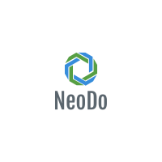

<div id="container">
    
</div>

### Description

Neodo can do:

* Detect projet root using project type specific patterns
* Detect projet root using generic patterns
* Detect projet type
* Run project specific commands

### Supported project types

- Mongoose OS
- CMake
- PHP(composer)

### Installation

Using `packer`:

```lua
use {
    'JanValiska/neodo',
    branch = 'devel'
}
```

### Configuration

The `setup()` function must be called to properly initialize plugin.
User can pass config paramters to this function to change default behavior of plugin or to add project type specific bindings.

Example:

```lua
local function bind_mongoose_keys()
    local opts = {noremap = true, silent = true}
    vim.api.nvim_buf_set_keymap(0, "n", "<leader>mb",
                                [[:lua require'neodo'.run('build')<CR>]], opts)
    vim.api.nvim_buf_set_keymap(0, "n", "<leader>mf",
                                [[:lua require'neodo'.run('flash')<CR>]], opts)
end

local function bind_cmake_keys()
    local opts = {noremap = true, silent = true}
    vim.api.nvim_buf_set_keymap(0, "n", "<leader>mb",
                                [[:lua require'neodo'.run('build_all')<CR>]], opts)
end

require'neodo'.setup({
    project_type = {
        mongoose = {user_buffer_on_attach = bind_mongoose_keys},
        cmake = {user_buffer_on_attach = bind_cmake_keys}
    }
})
```

### Definition of new project type

For example to add support for `Javascript` project type just create definition of javascrip project type with all needed commands specified:

```lua

local javascript = {
    name = "JS",
    commands = {
        update = {
            type = 'terminal',
            name = 'Update packages using NPM',
            cmd = 'npm update'
        }
    },
    patterns = {'packages.json'},
    buffer_on_attach = function()
        local opts = {noremap = true, silent = true}
        vim.api.nvim_buf_set_keymap(0, "n", "<leader>up",
                                    [[:lua require'neodo'.run('update')<CR>]], opts)
    end
}

require'neodo'.setup({
    project_type = {
        javascript = javascript,
    }
})
```

The `update` command can be executed using defined keybinding, or using `:Neodo update` or using `:Neodo` which will open `vim.ui.select` element.

Command can be also called from `lua` by using `require('neodo).run('update')`.

### Using project specific configuration

For every detected project(generic or type specific) the configuration file can be defined.
Using project specific configuration file user can extend default project specific commands or user can define commands for generic projects(they don't have commands defined by default).

Project specific config can be placed:
- In the source tree (`.neodo/config.lua` file of the project root)
- Out of source tree (`$datapath/neodo/project_hash/config.lua`)

To edit configuration use command:
`:NeodoEditProjectSettings`

If the project already has config file created, the file will be opened.
If the project config file not exists then user will be prompted to create in or out of source config file.

Example of project config file:
```lua
local M = {
    commands = {
        say_hello = {
            type = 'function',
            name = "Say Hello",
            cmd = function()
                print("Hello World!")
            end
        }
    }
}
return M
```
The configuration parameters are automatically reloaded on config file save.

### Examples

#### C++ example(CMake+conan)

TODO

#### Web development example

Project specific configuration file:

```lua
local M = {
    commands = {
        refresh_browser = {
            name = "Refresh browser",
            cmd = [[xdotool search --desktop all --class ldd_preview windowactivate  --sync \\%1 key Ctrl+Shift+r windowactivate $(xdotool getactivewindow)]],
            type = "background",
            notify = false,
        },
        build_scss = {
            name = "Compile CSS files",
            cmd = "./generate_css.sh",
            type = "background",
            on_success = function()
                require("neodo").run("refresh_browser")
            end,
            notify = false, 
        },
        deploy_test = {
            name = "Deploy",
            cmd = "./deploy.sh",
            type = "terminal",
        },
        open_browser = {
            name = "Open BROWSER",
            cmd = "firefox -P ldd --class=ldd_preview http://linkadeti/ &",
            type = "background",
        },
    },
    user_buffer_on_attach = function()
        local opts = { noremap = true, silent = true }
        vim.api.nvim_buf_set_keymap(0, "n", "<leader>mc", [[:lua require'neodo'.run('build_scss')<CR>]], opts)
    end,
    user_on_attach = function(project)
        local scss_files = project.path .. "/**/*.scss"
        local all_files = project.path .. "/**/*"

        vim.api.nvim_exec([[
            augroup PHPComposer
            autocmd BufWrite ]] .. scss_files .. [[ lua require'neodo'.run('build_scss')
            autocmd BufWrite ]] .. all_files .. [[ lua require'neodo'.run('refresh_browser')
            augroup end]], false)

        vim.schedule(function()
            require("neodo").run("open_browser")
        end)
    end,
}
return M
```

This configuration file defines 4 commands:
- refresh_browser
- build_scss
- deploy_test
- open_browser

There is also `user_buffer_on_attach` function defined. This function will define keymap for every opened project file.

The `user_on_attach` function defines function that will be called only once, when project is loaded(basically on first project file open). This function defines autocommands to automatically build `css` files when `scss` files are saved. Also the browser will be refreshed when some project specific file is saved.

### Roadmap

- Add support for other project types
  - C++/Makefile
- Add support for file specific commands (for example commands defined for every `.cpp` files)
