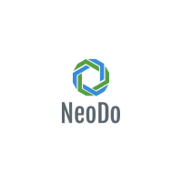

<div id="container">
    
</div>

### Description

Neodo is a lightweight Neovim plugin that automatically detects your project type and provides relevant commands. One readable config file per project.

### Features

- Auto-detect project type from files in project root
- One config file (`.neodo.lua`) per project - human readable, easy to edit
- CMake support with profiles, conan v1/v2, compile_commands.json symlink
- Cargo (Rust) commands auto-generated
- Node.js commands from package.json scripts (npm/yarn/pnpm/bun auto-detected)
- Makefile targets auto-parsed as commands
- Run commands in terminal tab or background
- Statusline component
- Command picker via `vim.ui.select`

### Supported project types

| Type | Detection | Commands |
|------|-----------|----------|
| CMake | `CMakeLists.txt` | configure, build, clean, conan install, select profile |
| Conan | `conanfile.txt`, `conanfile.py` | conan install (also integrates with cmake profiles) |
| Rust | `Cargo.toml` | build, build release, run, test, check, clippy, clean |
| Node | `package.json` | install + all scripts from package.json |
| Makefile | `Makefile` | all targets parsed from Makefile |
| Git | `.git` | (detection only) |

### Installation

Using `lazy.nvim`:

```lua
{
    'JanValiska/neodo.nvim',
    config = function()
        require('neodo').setup()
    end,
}
```

### Configuration

Call `setup()` to initialize the plugin:

```lua
require('neodo').setup({
    -- Register additional project type patterns (optional)
    project_types = {
        python = { 'pyproject.toml', 'setup.py' },
    },
})
```

### Project config file

Each project can have a `.neodo.lua` file in its root. For CMake projects, a default one is auto-generated on first open.

#### Simple project with custom commands

```lua
return {
    commands = {
        deploy = "rsync -avz ./dist/ user@server:/var/www/",
        test = "pytest -v",
        lint = "flake8 src/",
    },
}
```

#### CMake project with profiles

```lua
return {
    active = "debug",

    profiles = {
        debug = {
            build_dir = "build-debug",
            build_type = "Debug",
            cmake_options = {
                "-DBUILD_TESTS=ON",
            },
            build_args = { "-j12" },
            target = "my_app",
            debug_adapter = "cppdbg",
        },

        release = {
            build_dir = "build-release",
            build_type = "Release",
            conan = {
                profile = "default",
                -- remote = "my-remote",
                -- options = { "--build=missing" },
            },
            cmake_options = {},
            build_args = { "-j12" },
        },
    },

    commands = {
        flash = "openocd -f board.cfg -c 'program build-debug/firmware.elf verify reset exit'",
    },
}
```

Profile fields:
- `build_dir` - build directory (relative to project root)
- `build_type` - Debug, Release, RelWithDebInfo, MinSizeRel
- `cmake_options` - list of `-D` flags passed to cmake configure
- `build_args` - args passed after `--` to cmake build (e.g. `-j12`)
- `target` - default build/run target
- `conan.profile` - conan profile name (v1/v2 auto-detected)
- `conan.remote` - conan remote (optional)
- `conan.options` - extra conan args (optional)
- `debug_adapter` - DAP adapter name (optional)

#### Shared profile templates

Since `.neodo.lua` is Lua, you can share common settings across projects:

```lua
local shared = dofile(vim.fn.expand("~/work/profiles.lua"))
return {
    active = "ov41",
    profiles = {
        ov41 = vim.tbl_extend("force", shared.yukon_ov41, {
            build_dir = "build-ov41",
            target = "my_app",
        }),
    },
}
```

### Commands

| Command | Description |
|---------|-------------|
| `:Neodo` | Open command picker |
| `:Neodo <command>` | Run a specific command |
| `:NeodoEditConfig` | Open `.neodo.lua` for current project |

From Lua:

```lua
require('neodo').run('build')        -- run command by key
require('neodo').run_last()          -- repeat last command
require('neodo').neodo()             -- open picker
require('neodo').statusline()        -- returns e.g. "[cmake+conan] debug"
```

### Statusline

`require('neodo').statusline()` returns a string with detected project types and active cmake profile:

- `[cmake+conan] debug` - cmake project with conan, "debug" profile active
- `[rust]` - rust project
- `[node]` - node project
- `""` - no project detected

Example with mini.statusline or lualine:

```lua
-- lualine
sections = {
    lualine_x = {
        { function() return require('neodo').statusline() end },
    },
}
```

### Keybindings

```lua
vim.keymap.set('n', '<leader>mm', function() require('neodo').neodo() end)
vim.keymap.set('n', '<leader>ml', function() require('neodo').run_last() end)
vim.keymap.set('n', '<leader>mb', function() require('neodo').run('build') end)
```
